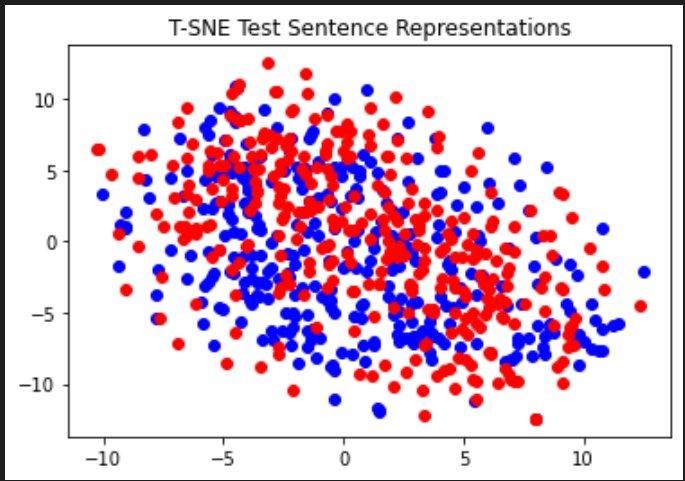
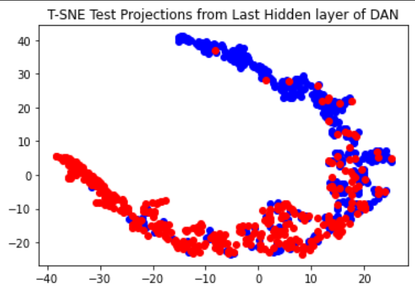
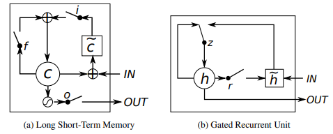
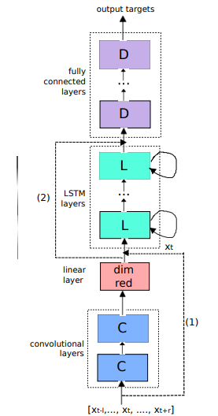

# Sentiment--Classification

## 1. Deep Averaging Network
Papers Referenced:
<ul>
<li>Efficient Estimation of Word Representations in Vector Space 
<li>Distributed Representations of Words and Phrases and their Compositionality 
<li>GloVe: Global Vectors for Word Representation
<li>Enriching Word Vectors with Subword Information 
</ul>
The aim is to study the use of different pre-trained word embeddings
(word2vec/GloVe/fastText) for text representation and use them for text classification using pre-trained word embeddings.  

A simple way to represent a sentence is to tokenize, vectorize and average the word vector
representations of all the words in the sentence. This simple approach of
text representation is used for solving a text classification problem.  

Used t-SNE to plot the text representations obtained using the above-mentioned method. 

 

## 2. Recurrent Units (RNN, LSTM, GRU)
<ul>
<li>Extensions of Recurrent Neural Network Language Model 

<li>Learning Phrase Representations using RNN Encoder–Decoder for Statistical Machine Translation 

<li>Sequence to Sequence Learning with Neural Networks 

<li>Empirical Evaluation of Gated Recurrent Neural Networks on Sequence Modeling 

</ul>

 The aim is to design a binary classifier for the sentiment classification
problem (now with large sentences). Every training set example contains a movie review and the corresponding sentiment
(positive/negative). The aim is to design a deep learning model for this dataset using any/all recurrent units. 

## 3. CLDNN(CNN-LSTM_DNN) model for sentence classification
<ul>
  <li> Model Consists of 1 CNN Layer followed by 1 GRU Layer followed by fully connected layer.
  <li> Word vectors in a sentence are given as input to the CNN layer with context window of 3 word vectors.
  <li> CNN's output is flattened out and given to GRU's input.
  <li> GRU output is given to fully connected layer which classifies the sentence.
  <li> References : Convolutional, Long Short-Term Memory, Fully Connected Deep Neural Networks : https://static.googleusercontent.com/media/research.google.com/en//pubs/archive/43455.pdf
</ul>  
 
 

